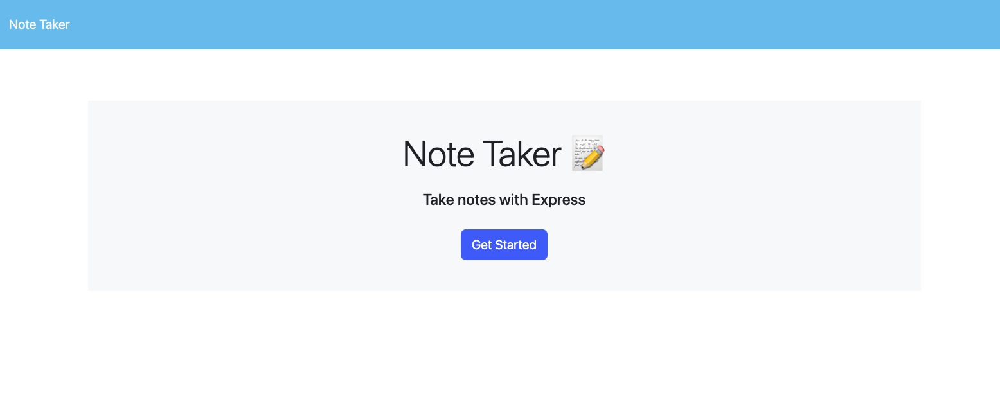

# Note Taker 

## Table of Contents
* [Description](#description)
* [Installation](#installation)
* [Usage](#usage)
* [License](#license)
* [Contributors](#contributors)
* [Tests](#tests)
* [Questions](#questions)

## Description
This Note Taker application is designed to practice the basic CRUD operations in software development. By connecting this front end application to a back end written in Express.js, this application can create new notes, read existing notes, update existing notes and finally, delete existing notes.  
## Installation
There is no installation for this application as it is hosted live at the link below. 
## Usage
To use this application, visit the link to the deployed application included in the description section. Once there, you can view existing notes saved in the application, delete saved notes, add your own notes and watch the application update with each change. To add a new note, simply click the plus sign on the top right corner, then type your title and test and click save. You will see your new note appear in the saved notes column on the left hand side. To delete a saved note, click the trash can button located next to the title of your saved note in the saved notes column. 
#### Example of command line prompts for this application.

## License
MIT License

https://opensource.org/licenses/MIT
## Contributors
This application uses front end code provided by UT Bootcamp instructors and a backend written by myself, Chase Ostien.
## Tests
This application does not currently have any written tests. You can however, test the function of the application by visiting the deployed site and creating, updating, reading and deleting notes. 
## Questions
### If you have any questions about this application, please send all correspondence to the contact info listed below. 
* GitHub: ChaseOstien - https://github.com/ChaseOstien
* Email: Chaseostien@gmail.com
